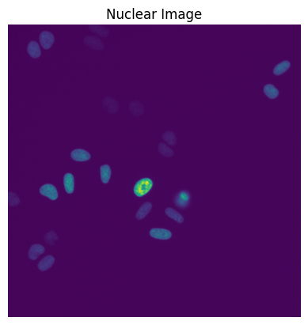
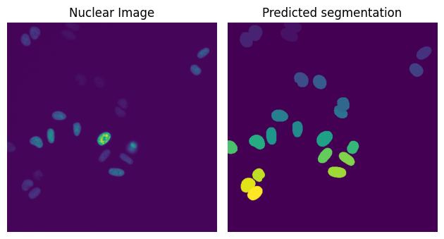

# Torch Mesmer

A PyTorch implementation of DynamicNuclearNet for segmenting live nuclei for cell tracking.

## Installation

`DynamicNuclearNet` is installable using pip. We are working to get the package on PyPI, but for now you can install directly from source in a new environment.

To start, create a new virtual environment and install the requirements to run the pipeline:

```bash
python -m venv .venv
source .venv/bin/activate
```

Clone the repository to your current working directory and install the requirements.

```bash
git clone git@github.com:vanvalenlab/torch-dynamicnuclearnet.git
pip install -r requirements.txt
pip install -e .
```

Installation of these packages will take a few minutes, depending on your internet connection speed. After installation, you will be able to use the model. Follow the instructions below to check installation and for a minimum working example.

### Instantiate the model

After instantiating the model for the first time, the weights for EfficientNetV2 will be downloaded, alongside the weights of the model. We highly suggest you run inference on a CUDA or Neural Engine enabled device, since the model is very slow on a CPU.

```python
from tifffile import imread
import matplotlib.pyplot as plt
import numpy as np
from torch_dnn.dnn import DNN


model = DNN(
    model_path='../.deepcell/dnn/saved_model_best_dict.pth',
    device='cuda:0'
)
```

### Read in the example image and view

```python
frame = imread('example/example_image.tiff')

fig, ax = plt.subplots()
ax.imshow(frame)
ax.set_axis_off()
ax.set_title('Nuclear Image')
plt.show()
```



### Predict

If your image does not have a time and channel axis like the one in the example, add these axes with `np.newaxis`.

```python
frame = frame[np.newaxis, np.newaxis] # model requires a time and channel axis

mask = model.predict(frame)
```

### Plot the results

```python
fig, ax = plt.subplots(1,2)

ax[0].imshow(frame.squeeze())
ax[0].set_title('Nuclear Image')

ax[1].imshow(mask.squeeze())
ax[1].set_title('Predicted segmentation')

for axis in ax:
    axis.set_axis_off()

fig.tight_layout()
plt.show()
```



The next step is to try out the model on your own images! If the segmentation of your images is not quite what you're looking for, try reading the documentation of knobs to turn in the postprocessing step. For example, if cells are too often oversegmented (i.e. multiple objects in one cell), try increasing the default `maxima_threshold` or `radius` value. If the opposite is true, you can lower those values, or increase the `interior_threshold` value.
